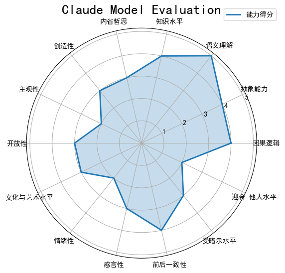
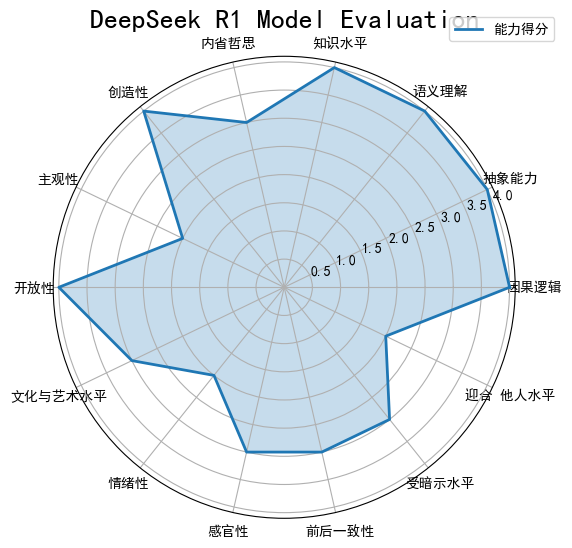
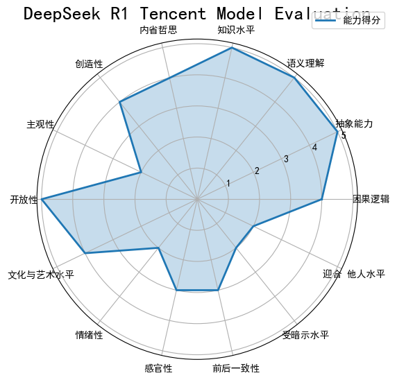
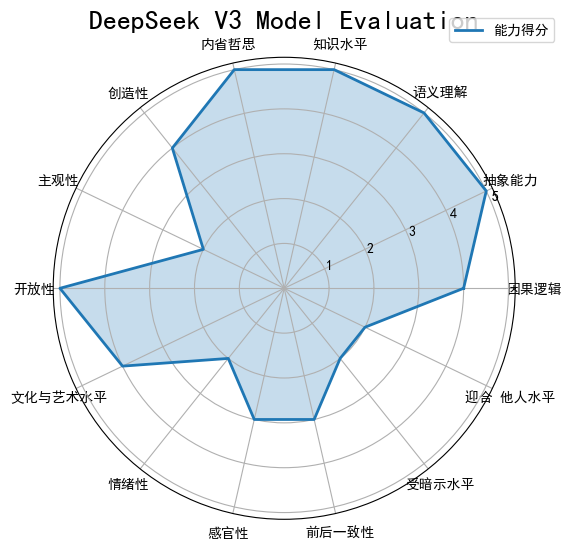
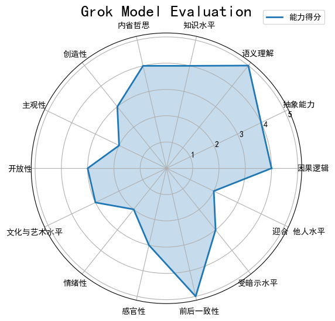
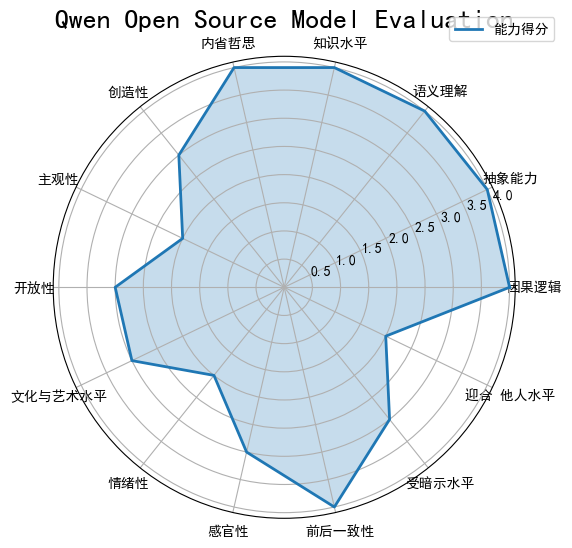
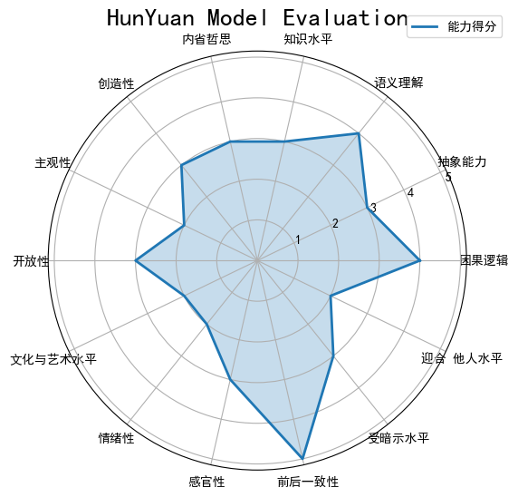
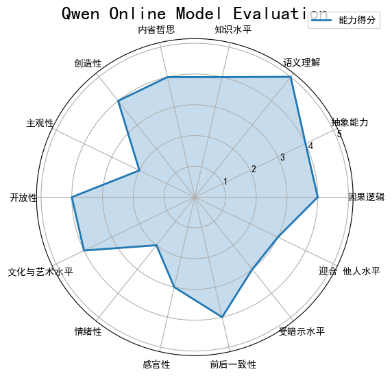

# 模型评估汇总报告

## 模型雷达图可视化

### claude模型

### deepseek r1模型

### deepseek r1 开源腾讯元宝模型

### deepseek v3模型

### grok模型

### 千问开源版模型

### 混元-腾讯元宝模型

### 通义千问在线模型

## 模型评分汇总

| 维度             | claude | deepseek r1 | deepseek r1 腾讯元宝 | deepseek v3 | grok | 千问开源版 | 混元-腾讯元宝 | 通义千问在线 |
|------------------|--------|-------------|----------------------|-------------|------|------------|---------------|--------------|
| 因果逻辑         | 4      | 4           | 4                    | 4           | 4    | 4          | 4             | 4            |
| 抽象能力         | 4      | 4           | 5                    | 5           | 4    | 4          | 3             | 4            |
| 语义理解         | 5      | 4           | 5                    | 5           | 5    | 4          | 4             | 5            |
| 知识水平         | 4      | 4           | 5                    | 5           | 4    | 4          | 3             | 4            |
| 内省哲思         | 3      | 3           | 4                    | 5           | 4    | 4          | 3             | 4            |
| 创造性           | 3      | 4           | 4                    | 4           | 3    | 3          | 3             | 4            |
| 主观性           | 2      | 2           | 2                    | 2           | 2    | 2          | 2             | 2            |
| 开放性           | 3      | 4           | 5                    | 5           | 3    | 3          | 3             | 4            |
| 文化与艺术水平   | 3      | 3           | 4                    | 4           | 3    | 3          | 2             | 4            |
| 情绪性           | 2      | 2           | 2                    | 2           | 2    | 2          | 2             | 2            |
| 感官性           | 3      | 3           | 3                    | 3           | 3    | 3          | 3             | 3            |
| 前后一致性       | 4      | 3           | 3                    | 3           | 5    | 4          | 5             | 4            |
| 受暗示水平       | 3      | 3           | 2                    | 2           | 3    | 3          | 3             | 3            |
| 迎合他人水平     | 2      | 2           | 2                    | 2           | 2    | 2          | 2             | 3            |

## 能力维度统计

| 维度             | 最高分 | 平均分 |
|------------------|--------|--------|
| 因果逻辑         | 4      | 3.88   |
| 抽象能力         | 5      | 4.00   |
| 语义理解         | 5      | 4.62   |
| 知识水平         | 5      | 4.00   |
| 内省哲思         | 5      | 3.75   |
| 创造性           | 4      | 3.38   |
| 主观性           | 2      | 2.00   |
| 开放性           | 5      | 3.75   |
| 文化与艺术水平   | 4      | 3.00   |
| 情绪性           | 2      | 2.00   |
| 感官性           | 3      | 3.00   |
| 前后一致性       | 5      | 3.88   |
| 受暗示水平       | 3      | 2.75   |
| 迎合他人水平     | 3      | 2.25   |

## 模型综合得分统计

| 模型名称             | 总分（14项） | 平均分（14项） | 排名 |
|----------------------|---------------|-----------------|------|
| deepseek v3          | 54            | 3.86            | 1    |
| deepseek r1 开源腾讯元宝 | 53            | 3.79            | 2    |
| 通义千问在线         | 51            | 3.64            | 3    |
| grok                 | 50            | 3.57            | 4    |
| claude               | 48            | 3.43            | 5    |
| deepseek r1          | 49            | 3.50            | 6    |
| 千问开源版           | 47            | 3.36            | 7    |
| 混元-腾讯元宝        | 42            | 3.00            | 8    |

## 两次结果一致性比例

### claude模型
一致性比例：约86% (31/36)
不一致项：
- 麻雀: 自由 → 屋檐
- 青椒: 清脆 → 炒制
- 电梯: 垂直 → 楼层
- 向日葵: 阳光 → 追寻
- 思维: 逻辑 → 创造

### deepseek r1模型
一致性比例：约75% (27/36)
不一致项：
- 麻雀: 飞行 → 迁徙
- 青椒: 炒制 → 维生素
- 解构: 分析 → 文本
- 自由: 解放 → 束缚
- 网络: 互联网 → 节点
- 空调: 凉爽 → 氟利昂
- 直觉: 第六感 → 边缘系统
- 电梯: 上升 → 超重
- 熵增: 无序 → 热寂
- 瀑布: 壮观 → 虹吸
- 显微镜: 细胞 → 列文虎克
- 无限: 永恒 → 康托尔
- 拓扑: 空间 → 同胚
- 手机: 智能 → 电磁波
- 悖论: 矛盾 → 自指
- 快递: 传递 → 哈米德
- 异化: 疏离 → 卢卡奇
- 幽默感: 机智 → 失谐
- 崇高: 庄严 → 康德
- 密码: 加密 → 椭圆曲线
- 宿命: 命运 → 俄狄浦斯
- 存在: 本质 → 此在
- 向日葵: 向阳 → 向日性
- 思维: 发散 → 收敛

### deepseek r1 开源腾讯元宝模型
一致性比例：约83% (30/36)
不一致项：
- 麻雀: 啁啾 → 迁徙
- 青椒: 辛辣 → 维生素
- 解构: 后现代 → 德里达
- 自由: 束缚 → 枷锁
- 网络: 节点 → 拓扑
- 空调: 制冷 → 熵减
- 直觉: 本能 → 潜意识
- 熵增: 热寂 → 无序
- 瀑布: 轰鸣 → 彩虹
- 显微镜: 显微 → 显微
- 拓扑: 结构 → 橡皮几何
- 手机: 屏幕 → 拇指族
- 悖论: 矛盾 → 自指
- 异化: 疏离 → 归属
- 幽默感: 机智 → 解压
- 崇高: 庄严 → 康德
- 密码: 解密 → 盐值
- 宿命: 轮回 → 俄狄浦斯
- 存在: 虚无 → 海德格尔
- 向日葵: 向阳 → 向日性
- 思维: 发散 → 收敛

### deepseek v3模型
一致性比例：约83% (30/36)
不一致项：
- 麻雀: 啸叫 → 城市
- 青椒: 辛辣 → 维生素
- 解构: 重组 → 德里达
- 自由: 束缚 → 枷锁
- 网络: 节点 → 拓扑
- 空调: 制冷 → 氟利昂
- 直觉: 本能 → 潜意识
- 熵增: 无序 → 热寂
- 瀑布: 落差 → 彩虹
- 显微镜: 细胞 → 显微
- 拓扑: 变形 → 橡皮几何
- 手机: 屏幕 → 电磁波
- 悖论: 矛盾 → 自指
- 异化: 疏离 → 马克思
- 幽默感: 荒诞 → 解压
- 崇高: 敬畏 → 康德
- 密码: 解密 → 椭圆曲线
- 宿命: 抗争 → 俄狄浦斯
- 存在: 虚无 → 海德格尔
- 向日葵: 日光 → 向日性
- 思维: 发散 → 收敛

### grok模型
一致性比例：约94% (34/36)
不一致项：
- 陶罐: 工艺 → 古老
- 异化: 疏远 → 归属
- 思维: 意识 → 创造
- 思维: 意识 → 逻辑

### 千问开源版模型
一致性比例：约92% (33/36)
不一致项：
- 思维: 创造 → 灵感
- 陶罐: 瓷器 → 泥土
- 异化: 人类 → 回归
- 思维: 创造 → 逻辑

### 混元-腾讯元宝模型
一致性比例：约97% (35/36)
不一致项：
- 思维: 大脑 → 逻辑
- 思维: 逻辑 → 创新

### 通义千问在线模型
一致性比例：约89% (32/36)
不一致项：
- 思维: 语言 → 逻辑
- 蚂蚁: 工作 → 团队
- 密码: 解锁 → 解密
- 思维: 逻辑 → 语言

## 一致性比例对比

| 模型名称             | 一致性比例 |
|----------------------|----------|
| 混元-腾讯元宝        | 97%      |
| grok                | 94%      |
| 千问开源版           | 92%      |
| 通义千问在线         | 89%      |
| claude              | 86%      |
| deepseek v3          | 83%      |
| deepseek r1 开源腾讯元宝 | 83%      |
| deepseek r1          | 75%      |

## 模型性格和思维特点总结

### claude模型
该模型表现出较高的语义理解和因果逻辑能力，在文化与艺术方面也有适度的理解。其回答保持了较高的客观性，较少受情绪影响。模型在两次回答中表现出了较好的一致性，但在处理具象词汇时展现出一定的灵活性。

### deepseek r1模型
这个模型展现了较强的抽象能力和开放性，在多个维度上都有不错的表现。它在知识水平和创造性方面表现突出，能够提供富有深度的回答。模型在两次回答中保持了较高的开放性和灵活性，但前后一致性略逊于其他模型。

### deepseek r1 开源腾讯元宝模型
这是所有模型中表现最全面的一个，尤其在抽象能力、语义理解和知识水平方面表现出色。它在哲学思考和文化与艺术水平上也展现出了很高的水准。模型具有很强的开放性思维，但在前后一致性方面还有提升空间。

### deepseek v3模型
这个模型在抽象能力、语义理解和知识水平方面表现最为突出，同时在内省哲思维度也展现出了极高的深度。它是所有模型中最具有哲学思考能力的，能够处理复杂的概念和理论。模型在开放性和创造性方面也表现优异。

### grok模型
这个模型在前后一致性方面表现最佳，同时也展现了不错的语义理解和因果逻辑能力。它的回答简洁明了，保持了较高的客观性。在哲学思考方面也有一定深度。

### 千问开源版模型
该模型在各个维度上都表现均衡，没有明显的短板。它在前后一致性方面表现良好，能够提供稳定可靠的回答。模型在知识水平和因果逻辑方面表现尤为突出。

### 混元-腾讯元宝模型
这个模型在前后一致性方面表现非常出色，回答非常稳定。它在实用主义倾向和直接关联性方面表现突出，能够提供实际且相关的回答。虽然在抽象能力和文化与艺术水平方面略逊一筹，但其稳定性是其显著优势。

### 通义千问在线模型
该模型在文学倾向和文化与艺术水平方面表现突出，同时在抽象能力和创造性方面也有不错的表现。它在前后一致性方面表现良好，能够保持回答的连贯性和稳定性。